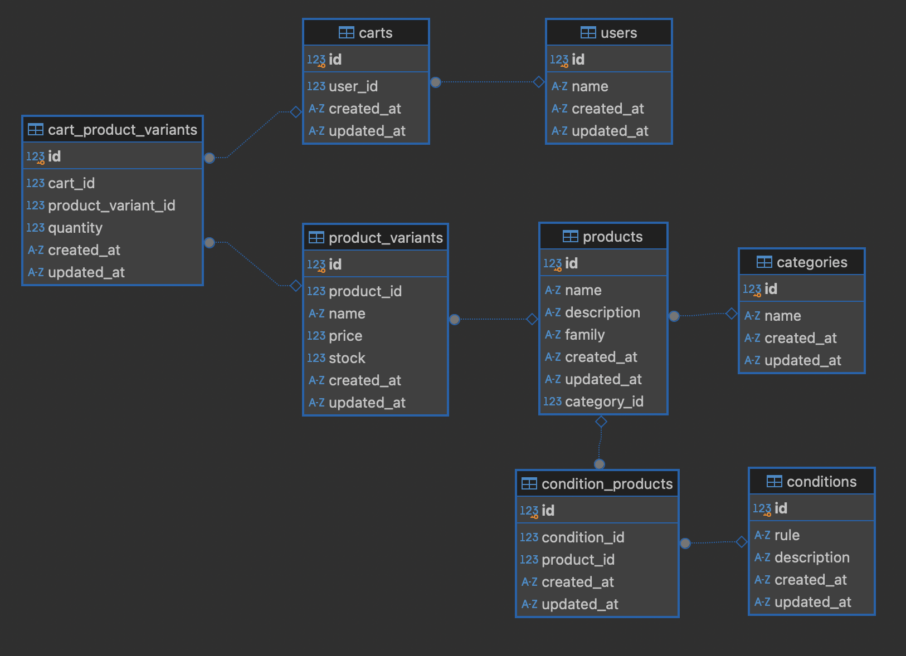
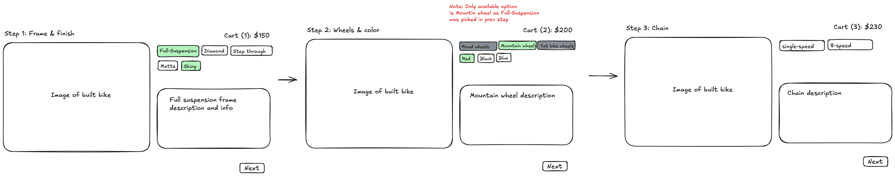

# Factorial HR Coding Challenge

- [Introduction](#introduction)
- [Answers](#answers):
  1. [Data Model](#1-data-model)
  2. [Main User Actions](#2-main-user-actions)
  3. [Product Page](#3-product-page)
  4. [Add to Cart Action](#4-add-to-cart-action)
  5. [Administrative Workflows](#5-administrative-workflows)
- [Next steps](#next-steps)

### Introduction

This repository contains an [AdonisJS](https://adonisjs.com) project that implements the data model designed to meet the requirements of the [Factorial HR coding challenge](docs/challenge.md).

AdonisJS was selected as the framework for its quick setup and developer-friendly environment, allowing me to focus on modeling the application's logic. Given its similarities to Ruby on Rails, AdonisJS was an ideal choice for this challenge.

The models representing the database schema, can be found in the [app/models](app/models/) directory. Additionally, a [seeder](database/seeders/category_product_product_variant_seeder.ts) has been provided to populate the database with test data, offering a clearer view on the schema.

An API endpoint (e.g., `/products?filter=frame`) has been implemented to return products along with their variants and associated conditions.

While a front-end implementation is not included in this project, it can be further explored and discussed in detail during the next interview.

To run the application locally to test out the endpoint:

- Make sure you are running node v22 or higher
- `npm i`
- `node ace migration:run`
- `node ace db:seed`
- `npm run dev`
- Visit [localhost:3333/products?filter=frame]() or `wheel`/`chain`

### Answers

#### 1. Data model

> What data model would best support this application? Can you describe it? Include table specifications (or documents if it's a non-relational database) with fields, their associations, and the meaning of each entity.

A relational database model is used for this application, as the relationships between entities are structured and interconnected. This ensures data integrity and consistency across the system.

The main tables are:

- `Product`: Represents a general item such as a mountain bike frame, a road bike frame, a chain, a road wheel, a mountain bike wheel. A `Product` cannot be added to the cart directly; it needs to have a specific variant (e.g., color, finish).

  - example: Mountain bike frame, Chain, Road wheel

- `ProductVariant`: Represents a specific version of a product with additional properties (e.g., color). This is the item that users add to the cart. `ProductVariant` also stores pricing and stock information. For instance, a matte mountain bike frame may be more expensive than a shiny one. Pricing is managed directly in the `ProductVariant` table.

  - example: Matte mountain bike frame, 8-speed chain, Black road wheel

- `Category`: Used to categorize a `Product` into groups like bicycles, skis, or climbing gear.

  - example: Bicycle, Ski, Climbing

- `Condition`: Defines relationships between products that are only compatible with each other or are incompatible for purchase together. It's assumed that `Conditions` apply to `Products` (not `ProductVariants`).

- `Cart`: Holds multiple `ProductVariants` selected by the user for purchase.

- `User`: Represents a customer.

The models along with their associations can be found in the [app/models](app/models/) directory.



#### 2. Main user actions

> Explain the main actions users would take on this e-commerce website in detail.

The website would have 2 main flows:

- **Normal Flow**: Browse products, add to cart, and checkout.
- **Bike-builder Flow**: A multi-step process where users select different parts to build a custom bike (e.g., frame, wheels, chain, etc.).

For the **Normal Flow**, the main actions would be:

1. Browsing the available `Products` along with their `ProductVariants`.
2. Selecting specific `ProductVariants` based on their preferences (e.g., color, size).
3. Adding chosen `ProductVariants` to the cart.
4. Proceeding to checkout.

For the **Bike-builder Flow** the process is multi-step, where the user selects parts in a specific order:

1. Choose a frame type and paint.
2. Select wheels and rim color.
3. Choose a chain.
4. Any additional steps that Marcus would want to add (such as selecting brakes, handlebars, saddle, etc.).

#### 3. Product page

> This is a read operation, performed when displaying a product page for the customer to purchase. How would you present this UI? How would you calculate which options are available? How would you calculate the price depending on the customer's selections?

For the **Normal Flow**, the product page would resemble a typical e-commerce site, offering filters by category, product family, etc. Users can click on a product to view its details.

For the **Bike-builder Flow** we can have the following UX:


At each step, we make a call to our api to display the indicated `Product` and its `ProductVariants`. For example, in step 2, a request to `/products?filter=wheel` returns a response like this:

```
[
  {
      "id": 5, // this is the Product
      "name": "Mountain wheels",
      "description": null,
      "family": "wheel",
      "createdAt": "2024-10-12T15:50:18.000+00:00",
      "updatedAt": "2024-10-12T15:50:18.000+00:00",
      "categoryId": 1,
      "productVariants": [ // these are the ProductVariants for Mountain wheels
        {
          "id": 9,
          "productId": 5,
          "name": "Blue",
          "price": 80,
          "stock": 10,
          "createdAt": "2024-10-12T15:50:18.000+00:00",
          "updatedAt": "2024-10-12T15:50:18.000+00:00"
        }
      ],
      "conditions": [ // Products that are compatible with each other
        {
          "id": 1,
          "rule": "REQUIRED",
          "description": "Mountain wheels only fit with a full-suspension frame",
          "createdAt": "2024-10-12T15:50:18.000+00:00",
          "updatedAt": "2024-10-12T15:50:18.000+00:00",
          "products": [
            {
              "id": 1 // Full-suspension frame
            },
            {
              "id": 5 // Mountain wheels
            }
          ]
        }
      ]
    },
    {
      "id": 6,
      "name": "Fat bike wheels",
      "description": null,
      "family": "wheel",
      "createdAt": "2024-10-12T15:50:18.000+00:00",
      "updatedAt": "2024-10-12T15:50:18.000+00:00",
      "categoryId": 1,
      "productVariants": [
        ...
        ...
]
```

In this case, we can observe that in the `conditions` object a Full-suspension frame is only compatible with Mountain wheels. If the user had selected a Full-suspension frame in the previous step then we can display Mountain wheels as the only selectable option. This logic can be handled in our front-end application.

The total price is calculated by summing the prices of the selected `ProductVariants`.

#### 4. Add to cart action

> Once the customer makes their selection, there should be an "add to cart" button. What happens when the customer clicks this button? What is persisted in the database?

When the customer clicks the "Add to Cart" button, the following occurs:

1. A new `Cart` entry is created with the customer's user_id.
2. Each selected `ProductVariant` is added to the cart, along with the specified quantity, as a `CartProductVariant`.
3. The UI is updated to reflect the addition, showing the total price and selected products in the cart.

#### 5. Administrative workflows:

> Describe the main workflows for Marcus to manage his store.

> New product creation: What information is required to create a new product? How does the database change?

To create a new `Product`, Marcus needs to provide the following information:

- Name: The name of the product (e.g., "Mountain Bike Frame").
- Description: A description of the product.
- Family: The type of product (e.g., frame, wheel, chain).
- Category: The product category (e.g., bicycle, ski, climbing).

This information would be stored as a new row in the `Product` table.

> Adding a new part choice: How can Marcus introduce a new rim color? Describe the UI and how the database changes.

In this model, the base `Product` does not hold pricing information. Instead, prices are associated with `ProductVariants` to reflect real-world scenarios where parts (e.g., frames) vary in price based on their attributes (e.g., color, finish). This assumption is based on the idea that when a seller purchases from a supplier, the product often comes in specific variations (e.g., painted with a color).

To introduce a new rim color, Marcus would navigate to the `ProductVariant` creation page and input:

- Name: The name of the product variation (e.g., "Matte").
- Price: The price of the specific variation.
- Stock: The quantity available in inventory.
- Product: The `Product` associated with this variation (selected from a dropdown)

> Setting prices: How can Marcus change the price of a specific part or specify particular pricing for combinations of choices? How does the UI and database handle this?

Since prices are stored in the `ProductVariant` table, Marcus can directly update the price of any specific variant (e.g., increasing the price of a red road wheel compared to a black one).

If Marcus needs to set special pricing for combinations of `ProductVariants` (e.g., a discounted bundle of a red road wheel and a black road frame), a new table would be required to track these dependent prices (e.g., `SpecialPricing`). This table could store pricing rules for specific combinations of `ProductVariants` to handle promotions or bundle pricing (e.g., a "buy together" discount).

### Next steps

In a real-world scenario, the development process for this e-commerce website would be iterative. This design can be presented to stakeholders and changes can be applied accordingly. Next steps would involve:

1. Stakeholder review and feedback
2. Architectural decisions
3. Implementation
4. Agile development and continuous feedback
